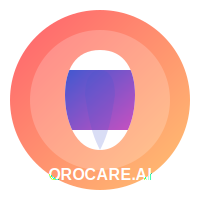

# OrocareAI Diagnosify



A dental diagnosis AI application that analyzes dental images (X-rays, oral photos, and orthodontic images) to provide comprehensive dental assessments and treatment recommendations.

## Features

- **AI-Powered Analysis**: Uses OrocareAI RLM (Reinforcement Learning Model) to analyze dental images
- **Multiple Diagnosis Types**: Support for X-ray, oral condition, and orthodontic assessments
- **Comprehensive Results**: Provides clinical findings, teeth analysis, treatment recommendations, and patient guidance
- **Modern UI**: Apple Macintosh-inspired interface with vibrant ARC browser-like color gradients
- **Dark Mode**: Support for light and dark themes
- **Responsive Design**: Works on desktop and mobile devices

## Tech Stack

- React
- TypeScript
- Tailwind CSS
- Vite
- Netlify for deployment

## Development

### Prerequisites

- Node.js (v18+)
- npm or yarn

### Installation

1. Clone the repository:
   ```bash
   git clone https://github.com/theantideather/OROCARE.DIAGNOSIFY.git
   cd OROCARE.DIAGNOSIFY
   ```

2. Install dependencies:
   ```bash
   npm install
   ```

3. Create a `.env` file based on `.env.example`:
   ```bash
   cp .env.example .env
   ```

4. Update your environment variables:
   - For Gemini API: Get API key from [Google AI Studio](https://makersuite.google.com/app/apikey)
   - For other services: Replace with your actual keys

   ⚠️ **IMPORTANT: Never commit your real API keys to version control** ⚠️
   
5. Start the development server:
   ```bash
   npm run dev
   ```

### Building for Production

```bash
npm run build
```

## Deployment

This project is configured for easy deployment on Netlify. Simply connect your GitHub repository to Netlify, and the application will be automatically deployed.

1. Important: Set up environment variables in Netlify project settings. This includes:
   - VITE_GEMINI_API_KEY
   - Other environment variables as needed

2. Deploy using the Netlify CLI or GitHub integration:

[](https://app.netlify.com/start/deploy?repository=https://github.com/theantideather/OROCARE.DIAGNOSIFY)

## Security

- This project uses environment variables to manage sensitive API keys and credentials
- The `.env` file is included in `.gitignore` to prevent accidental commits
- Always rotate API keys if you suspect they've been exposed
- Never include real API keys in `.env.example` files or commits

## License

MIT License

## Acknowledgements

- Inspired by modern dental diagnostic technologies
- UI design inspired by Apple Macintosh and ARC browser aesthetics
- For urgent dental concerns, seek immediate professional care